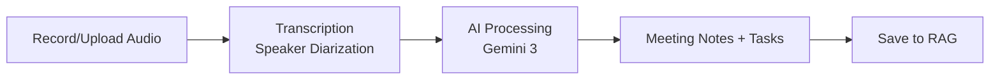
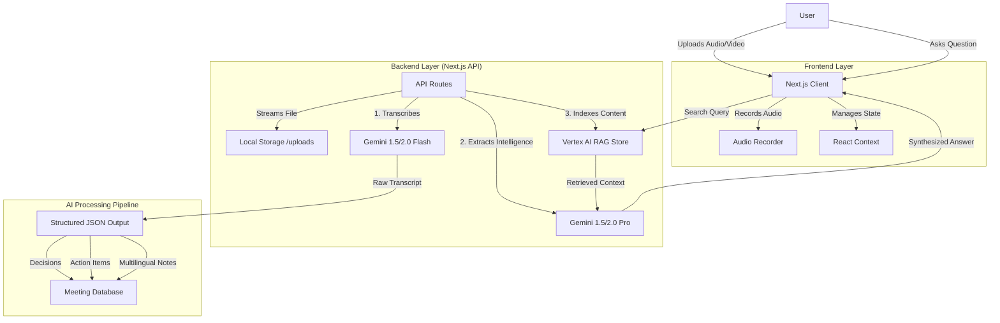

# Remembry - AI Meeting Notes

> **Version:** 1.0
> **Status:** In Development

An intelligent platform that transforms meeting recordings into structured, actionable meeting notes. Powered by Gemini AI for transcription, intelligent extraction, and semantic search.

## 🎯 Vision

Automatically convert meeting recordings into comprehensive notes with:

- **Accurate transcription** with speaker diarization
- **Smart extraction** of decisions, action items, and Q&A pairs
- **Multi-language support** for meeting notes output
- **Semantic search** across all your meetings

## 🔄 Core User Flow



## 🛠️ Tech Stack

### Frontend

- **Framework:** Next.js 14+ (App Router)
- **Styling:** Tailwind CSS + shadcn/ui
- **State Management:** React Context
- **File Upload:** Native file input + drag-and-drop

### Backend

- **Framework:** Next.js API Routes
- **Storage:** Local file system (uploads/)

### AI & Services

- **Transcription:** Gemini 3 Flash (with auto-chunking for long files)
- **AI Processing:** Gemini 3 Flash/Pro (structured output extraction)
- **RAG Search:** Vertex AI RAG Store (semantic search across meetings)

## 📋 Key Features

### Module 1: Audio Ingestion

- Upload audio files (MP3, WAV, M4A, WebM, MP4)
- **In-browser audio recording** with microphone access
  - Start/stop/pause/resume recording controls
  - Real-time duration display
  - Audio playback preview before submission
- Meeting metadata input (title, project, notes)
- Upload progress indicator
- Audio file validation (size, format)

### Module 2: Transcription

- Automatic transcription using **Gemini 3 Flash**
- **Audio chunking** for large files
- Multi-speaker diarization
- Multi-language support
- Real-time processing status updates

### Module 3: AI Extraction

- Generate meeting summary
- Extract decisions made
- Extract action items
- Extract Q&A pairs
- Extract key topics and assumptions
- **Multi-language notes output** - generate notes in multiple languages simultaneously

### Module 4: RAG Search (Vertex AI)

- Semantic search across all meetings
- "When did we decide X?" queries with source citations
- Project-based organization
- Deep links to meeting details

### Module 5: Projects

- Organize meetings by project
- Each project has its own RAG store
- Project-level search and analytics

## 🏗️ System Architecture



## 🧠 Gemini Integration

Remembry is powered entirely by the **Gemini 3 Flash** model (`gemini-3-flash-preview`), leveraging its speed, multimodal capabilities, and massive context window.

### 1. Unified Transcription & Reasoning

We use Gemini 3 Flash to handle both transcription and reasoning in a single pass. The 1M+ token context window allows us to process hour-long meetings as a single context block, ensuring that references made at the end of a meeting correctly resolve to context established at the beginning.

### 2. Structured Intelligence Extraction

Instead of simple summaries, we force **JSON structured outputs** to create a database of record:

- **Decisions:** Extracted agreements with context.
- **Action Items:** Tasks assigned to specific owners.
- **Q&A Pairs:** Logical grouping of questions and valid answers.

### 3. Multilingual Reasoning

We leverage Gemini 3's multilingual capabilities to generate notes in 12+ languages. The model is instructed to **preserve technical domain terminology** (e.g., "RAG", "Next.js", "API") in the original language while translating the surrounding context, ensuring professional-grade output.

### 4. RAG-based Semantic Search

Our "Ask My Meetings" feature uses a RAG pipeline. When a user asks a question, we retrieve relevant meeting chunks from the Vertex AI RAG Store and use Gemini 3 to synthesize a grounded answer, citing the specific meeting and timestamp.

## 🚀 Getting Started

### Prerequisites

- Node.js 18+
- Google Cloud account (for Gemini API and Vertex AI)

### Installation

```bash
# Install dependencies
npm install

# Set up environment variables
cp .env.example .env.local
# Edit .env.local with your API keys

# Run the development server
npm run dev
```

Open [http://localhost:3000](http://localhost:3000) to see the application.

### Environment Variables

```bash
# Google Cloud / Gemini
GEMINI_API_KEY=your-gemini-api-key
GOOGLE_CLOUD_PROJECT=your-project-id
GOOGLE_APPLICATION_CREDENTIALS=path/to/service-account.json

# Authentication (optional)
NEXTAUTH_URL=http://localhost:3000
NEXTAUTH_SECRET=your-secret-key
```

## Getting Started

### Prerequisites

- Node.js 18.0.0 or later
- A Google Cloud Project with Vertex AI API enabled (optional, for advanced RAG)
- A Google Gemini API Key

### Installation

1. **Clone the repository**

   ```bash
   git clone https://github.com/yourusername/remembry.git
   cd remembry
   ```
2. **Install dependencies**

   ```bash
   npm install
   # or
   yarn install
   # or
   pnpm install
   ```
3. **Environment Setup**
   Copy the example environment file and configure your keys:

   ```bash
   cp .env.example .env
   ```

   Open `.env` and add your API keys:

   ```env
   # Required for all AI features
   GEMINI_API_KEY=your_gemini_api_key_here
   ```

   *Get your key at [Google AI Studio](https://aistudio.google.com/app/apikey)*
4. **Run the Development Server**

   ```bash
   npm run dev
   ```
5. **Open the App**
   Visit [http://localhost:3000](http://localhost:3000) in your browser.

## 🀽� Project Structure

```
remembry/
├── src/
│   ├── app/                    # Next.js App Router pages
│   │   ├── api/                # API routes
│   │   │   ├── meetings/       # Meeting CRUD and upload
│   │   │   ├── projects/       # Project management
│   │   │   ├── search/         # Search API
│   │   │   └── ask/            # AI Q&A endpoint
│   │   ├── dashboard/          # Dashboard view
│   │   ├── meetings/           # Meeting list and details
│   │   │   ├── new/            # Upload new meeting
│   │   │   └── [id]/           # Meeting detail view
│   │   ├── projects/           # Project management
│   │   ├── search/             # Search across meetings
│   │   └── settings/           # App settings
│   ├── components/
│   │   ├── layout/             # Layout components (sidebar, dashboard)
│   │   └── ui/                 # shadcn/ui components
│   ├── hooks/                  # Custom React hooks
│   └── lib/                    # Utility functions (gemini.ts, fileSearch.ts)
├── uploads/                    # Local meeting storage
├── public/                     # Static assets
└── package.json
```
