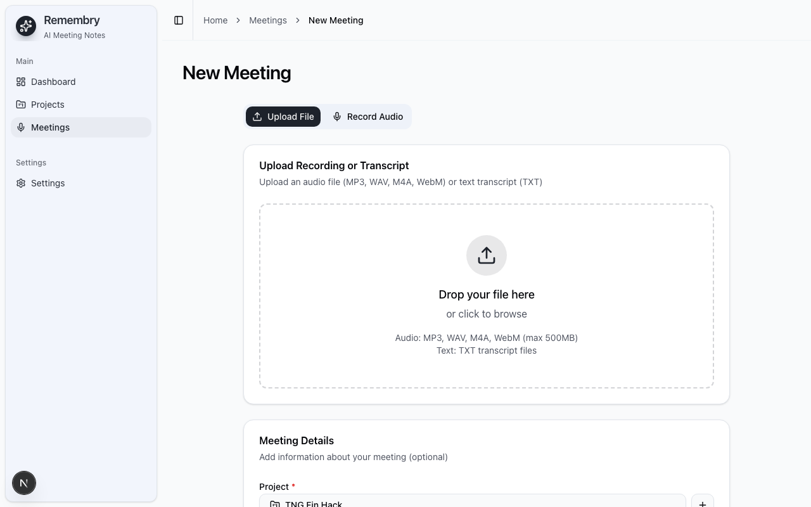
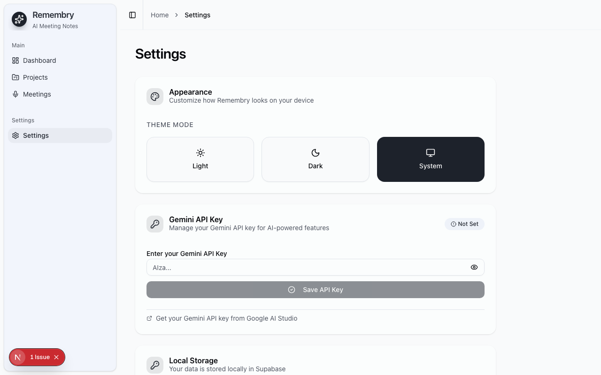

<p align="center">
    
</p>

<p align="center">
    
</p>

<p align="center">
    <a href="https://nextjs.org/"></a>
    <a href="https://react.dev/"></a>
    <a href="https://supabase.com/"></a>
    <a href="https://ai.google.dev/"></a>
    
    
</p>

<p align="center">
    <strong>Remembry</strong> is a self-hosted AI-powered meeting notes application. Install it on your own computer, and access it through your browser. All your data stays local — no cloud dependencies, no subscriptions.
</p>

---

## Features

- **Audio Recording** — Record directly in browser with microphone support
- **File Upload** — Upload MP3, WAV, M4A, WebM, or MP4 files
- **AI Transcription** — Automatic transcription with speaker diarization
- **Smart Extraction** — Extract decisions, action items, and Q&A pairs
- **Multi-language Notes** — Generate notes in 12+ languages
- **Semantic Search** — Ask questions like "When did we decide X?"
- **Project Organization** — Organize meetings by project or client

---

## Screenshots

| Page | Preview |
|------|---------|
| **Home (Meetings)** |  |
| **Meetings List** |  |
| **New Meeting** |  |
| **Settings** |  |

---

## Tech Stack

| Layer | Technology |
|-------|------------|
| Frontend | Next.js 16, React 19, Tailwind CSS v4, shadcn/ui |
| AI | Google Gemini 3 Flash |
| Database | Supabase (local) |
| Styling | Tailwind CSS + CSS variables |

---

## Quick Start

### Prerequisites

- Node.js 18.0.0 or later
- Supabase CLI
- Gemini API key ([get one free](https://aistudio.google.com/app/apikey))

### Setup

```bash
# 1. Clone the repository
git clone https://github.com/kongjiyu/remembry.git
cd remembry

# 2. Install dependencies
npm install

# 3. Start local Supabase
supabase start

# 4. Configure environment
cp .env.example .env.local
# Edit .env.local with your Supabase values

# 5. Initialize database
psql -h 127.0.0.1 -p 54322 -U postgres -d postgres -f supabase/migrations/001_initial_schema.sql

# 6. Run the app
npm run dev
```

Open [http://localhost:3000](http://localhost:3000) and go to **Settings** to enter your Gemini API key.

---

## How It Works

```
┌─────────────┐     ┌─────────────┐     ┌─────────────┐     ┌─────────────┐
│  Record or  │────▶│ Transcribe  │────▶│  Extract    │────▶│   Store     │
│   Upload    │     │  (Gemini 3) │     │  (Gemini 3) │     │ (Supabase)  │
└─────────────┘     └─────────────┘     └─────────────┘     └─────────────┘
```

---

## Project Structure

```
remembry/
├── src/
│   ├── app/                    # Next.js App Router
│   │   ├── api/                # API routes
│   │   │   ├── meetings/       # Meeting CRUD, upload, analyze
│   │   │   ├── projects/       # Project management
│   │   │   └── settings/       # Settings API
│   │   ├── meetings/           # Meeting pages
│   │   ├── projects/           # Project pages
│   │   └── settings/           # App settings
│   ├── components/
│   │   ├── layout/             # Sidebar, breadcrumbs
│   │   └── ui/                 # shadcn/ui components
│   └── lib/
│       ├── gemini.ts           # AI transcription & extraction
│       ├── fileSearch.ts       # RAG search
│       └── supabase.ts         # Database client
├── supabase/
│   └── migrations/             # Database schema
├── public/                     # Static assets & screenshots
└── package.json
```

---

## FAQ

**Do I need a Gemini API key?**
Yes, but Google offers a generous free tier. Visit [Google AI Studio](https://aistudio.google.com/app/apikey) to get started.

**Where is my data stored?**
All data is stored in your local Supabase instance. Your meeting recordings and notes never leave your computer.

**How is this different from cloud services?**
Remembry is self-hosted. You install and run it on your own hardware — complete data privacy, no subscription fees, no internet connection required.

---

## License

MIT License. See [LICENSE](LICENSE) for details.
